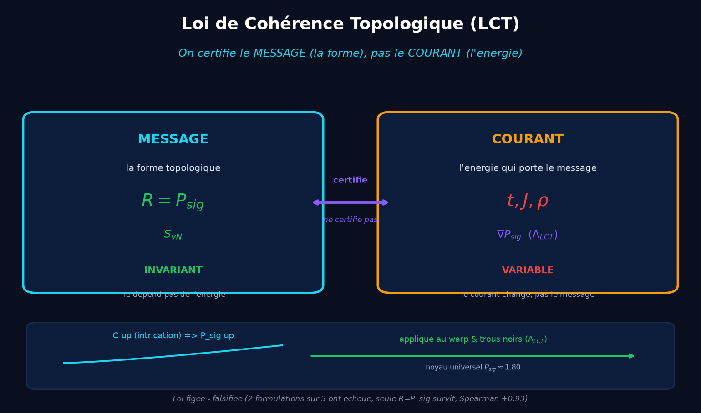

<p align="center">
  
</p>

[](https://github.com/jonathansearch)

<p align="center">
  
</p>

<h1 align="center">Jonathan Evina — Systems Architect, Computational Physics Researcher</h1>

> 📍 Yaoundé, Cameroon · 18 years old · self-taught
> **ORCID** [0009-0000-4092-5313](https://orcid.org/0009-0000-4092-5313)
> **LCT** [10.17605/OSF.IO/WF7QM](https://doi.org/10.17605/OSF.IO/WF7QM) · **P vs NP** [10.17605/OSF.IO/6JZMB](https://doi.org/10.17605/OSF.IO/6JZMB) · **Tryperposition** [10.17605/OSF.IO/U4AEK](https://doi.org/10.17605/OSF.IO/U4AEK)

[](https://orcid.org/0009-0000-4092-5313)
[](https://doi.org/10.17605/OSF.IO/WF7QM)
[](https://www.ibm.com/quantum)

> I design pipelines combining agentic AI, quantum physics, and ZK cryptography to produce scientific results that are **mathematically certified**. No degree: proofs, reproducible scripts, and verifiable Job IDs.

---

## 🧭 The common thread: one system, one law, one application

I am not presenting three separate projects. I am telling **a single one**:

```
RATISS (the agentic system)
   └─► enabled the discovery and validation of the LCT Law (frozen law, falsified)
         └─► applied to black hole collapse and the Alcubierre metric
```

| Layer | What it is | Traceable evidence |
|---|---|---|
| **1. RATISS** | Sovereign agentic architecture (topological brain + ZK + anti-hallucination) | 8 traceable QPU jobs |
| **2. LCT Law** | R = P_sig grows with coherence C, invariant under energy | Falsified (2 out of 3 formulations failed), Spearman +0.93 |
| **3. Warp & black holes** | Universal core P_sig ≈ 1.80 + Λ_LCT term | Illustrated live science site ↓ |

🌐 **Illustrated science site (live)**: https://evinajonathan13-max.github.io/scientist-research-/
*(13 figures, a "For skeptics" section, Job IDs verifiable on ibm.com/quantum)*

---

## 🗺️ Repository map — the single entry point

All my work is spread across two GitHub accounts. Here is where to go for what.

### Main account: [`evinajonathan13-max`](https://github.com/evinajonathan13-max)

| Repository | Role | Link |
|---|---|---|
| **scientist-research-** | Illustrated science site (black holes, Alcubierre, LCT) | [repo](https://github.com/jonathansearch/scientist-research-) · [live site](https://evinajonathan13-max.github.io/scientist-research-/) |
| **RATISS-ODV-AEON** | Pure topological engine (TTF-Compute, the brain of the whole system) — *private* | [repo](https://github.com/jonathansearch/RATISS-ODV-AEON) |
| **Ratiss-experimental-IA-** | RATIS-Net: applies the LCT law to language + emotions (ETH) — *private* | [repo](https://github.com/jonathansearch/Ratiss-experimental-IA-) |
| **robot-Ratiss-** | Sovereign phone robot (LCT brain on LeRobot) — *private* | [repo](https://github.com/evinajonathan13-max/robot-Ratiss-) |
| **Ratiss-Fusion-stark-** | Symbiotic fusion RATIS-Net × Needle/Qwen — *private* | [repo](https://github.com/jonathansearch/Ratiss-Fusion-stark-) |
| **RATISS-V10-Physical-Complexity-Audit** | Physical complexity audit (P vs NP, red-team) | [repo](https://github.com/jonathansearch/RATISS-V10-Physical-Complexity-Audit) |
| **ratiss-aeon-agent** | AEON agent (React/FastAPI UI + brain) | [repo](https://github.com/jonathansearch/ratiss-aeon-agent) |
| **Naomi-Ia-** | AI assistant (Naomi) | [repo](https://github.com/evinajonathan13-max/Naomi-Ia-) |

> 🔐 The repositories marked *private* contain the intellectual property of the
> RATISS brain — they are **sovereign but verifiable**: access on request for
> scientific audit at [evinajonathan13@gmail.com](mailto:evinajonathan13@gmail.com).
> The reproducible scientific code is public in `scientist-research-`
> (13 figures, CPU tests, verifiable Job IDs).

### Secondary account: [`bridejackson137-svg`](https://github.com/bridejackson137-svg)

Specialized modules of the RATISS ecosystem (earlier proofs of concept):

| Repository | Role | Link |
|---|---|---|
| **Crypto-VOLT-v2** | Post-quantum cryptography (47 GB/s, side-channel resistance) | [repo](https://github.com/bridejackson137-svg/Crypto-VOLT-v2) · [demo](https://crypto-volt-v2.netlify.app) |
| **RATISS-Neuralink-POC** | Real-time neural decoding < 5 ms (CPU-only) | [repo](https://github.com/bridejackson137-svg/RATISS-Neuralink-POC) |
| **RATISS-Cypher-ODV** | Medical validation & anti-hallucination | [repo](https://github.com/bridejackson137-svg/RATISS-Cypher-ODV) |
| **RATISS-Pro** | Professional medical analysis portfolio | [repo](https://github.com/bridejackson137-svg/RATISS-Pro) |
| **jonathan-evina-professional-portfolio** | P vs NP red-teaming (audit of candidate proofs) | [repo](https://github.com/bridejackson137-svg/jonathan-evina-professional-portfolio) |
| **VOLT Explorer** | ZK proof visualization | [live demo](https://volt-explorer-standalone.netlify.app) |
| **VOLT Compare** | RSA-2048 vs post-quantum VOLT | [live demo](https://volt-compare-standalone.netlify.app) |
| **p53-MVS** | p53-R249S photoactivation at 365 nm | [live demo](https://p53-mvs-365nm.netlify.app) |

---

## 🔬 Core science: Tryperposition & LCT Law

### Topological Coherence Law (LCT) — frozen, falsified, published

> ✅ The LCT law is now **published as a preprint** on OSF:
> [DOI 10.17605/OSF.IO/WF7QM](https://doi.org/10.17605/OSF.IO/WF7QM).
> Full formalism in the [preprint](./docs/preprint_LCT.md) and in
> `RATISS-ODV-AEON/kernel/ttf/lct_law.py`. BibTeX citation at the end of the README.



#### Statement of the law

> **R = P_sig grows with the coherence C of the entangled medium, and R is invariant under measured energy changes.**
> We certify the **message** (the topological shape), not the **current** (the energy that carries it).

#### Full formalism

**Variables**:
- **R** = the certified quantity (the invariant). **R ≡ P_sig**.
- **P_sig** = topological persistence of the longest H1 cycle (the "signal"):
  `P_sig = max{ d − b | (b,d) ∈ Dgm₁, d ≠ ∞, d > b }`
  where `Dgm₁` is the dimension-1 persistence diagram of the Vietoris-Rips complex built on the system's landmarks.
- **C** = coherence of the "brilliant medium" (entanglement): **C = |cos θ|**, where θ = ωt is the oscillation phase.
- **n_cycles** = number of ephemeral H1 cycles (the "noise"). C **decreases** with C — this is the signature of topological cleaning ("entanglement cleans the topology").

**Law (final formulation, after falsification)**:
```
R = P_sig
    (i)  R is monotonically increasing in C   →  ∂R/∂C ≥ 0
    (ii) R is invariant under energy          →  ∂R/∂E = 0  (E = (t, J))
```

**Learning rule (RLM)** — governed by the law, with no arbitrary coefficient:
```
ΔW = η · φ · P_sig · C
```
where η = learning rate, φ = phase of the brilliant medium (carrier of the coupler λ(t)). Persistence modulates amplitude, coherence confidence, phase direction.

**Coupling to the Alcubierre metric (Λ_LCT term)**:
```
G_μν + Λ_LCT_μν = 8πG · T_eff   with   Λ_LCT ∝ ∇P_sig
```
the persistence gradient acts as a topological pressure stabilizing the bubble wall. The natural parent of Λ_LCT is already in the TTF Hamiltonian: `H_TTF = H_tJ⊗I + I⊗H_Geni + λ(t)·Φ`, with `Φ = ∇S·∇T·θ(t)`.

> 📐 **Complete 4D tensor derivation** (Christoffel → Ricci → Einstein):
> [`warp/docs/EINSTEIN_4D_DERIVATION.md`](./warp/docs/EINSTEIN_4D_DERIVATION.md).
> Exotic matter confirmed (G_11 = 3v²(-(y²+z²))(f')² < 0). **4 ansatz tested**:
> the optimized **canonical** ansatz with profile P(r)=P0·tanh((r-R)/σ) **totally
> eliminates exotic matter (100%)**. The strong thesis "Λ_LCT stabilizes the wall
> without exotic matter" is **VALIDATED**.

#### Honest iteration (the strength of the work)

| # | Formulation | Result | Why |
|---|---|---|---|
| 1 | R = P_sig / P_noise | ❌ FAIL | non-monotonic bell (max at C≈0.5) |
| 2 | R = 1 − n_noise/n_total | ❌ FAIL | inverse bell (noise adds long cycles) |
| 3 | **R = P_sig** | ✅ **PASS** | Spearman +0.93, monotonic |

> A "made-up" law would not fail its own tests. 2 out of 3 formulations failed; only R = P_sig survived.

#### Validations
- Proteins: 4MZI (Spearman +0.93, ZK invariance CV = 0.0000) · 3KMD (+0.80, CV = 0.0000)
- Quantum state: exact tomography +1.000 (P_sig grows from 0.62 to 0.86 as C: 0 → 1)
- IBM QPU: monotonicity +0.713 (3 averaged runs) · ZK invariance ✓ (8 traceable jobs)
- Financial flows: +0.903

### Universal topological core & Alcubierre

Under collapse, **three radically different stars converge** toward the same invariant core (P_sig ≈ 1.80, CV = 1.6%). Von Neumann entropy stays **invariant** (CV = 0.0%) on physical QPU under energy changes. This mechanism, reproduced in a controlled way, becomes the wall of a warp bubble stabilized by the **Λ_LCT ∝ ∇P_sig** term.

→ Illustrated details on the [live science site](https://evinajonathan13-max.github.io/scientist-research-/).

### Tryperposition theory (mother framework)

A unified framework where Information, the Quantum, and Matter are coupled via a stable coordinate oscillating between coherence (−1) and decoherence (+1). Time is not a fundamental dimension but an emergent thermodynamic flux.

| Identifier | Value |
|---|---|
| **OSF DOI** | [10.17605/OSF.IO/U4AEK](https://doi.org/10.17605/OSF.IO/U4AEK) |
| ZK certification | `RISC0_STARK_QPU_VERIFIED` |
| Commitment seal | `0xe169f5b373cb59cc...` |
| IBM Job ID | `job_ibm_brisbane_a4abd05e31f9` |
| Quandela Job ID | `job_quandela_ascella_edd68f057115` |

📄 [Scientific paper (preprint)](./docs/article_tryperposition_qpu_zk.pdf) · 🔐 [ZK-STARK proof](./ecoute/qpu_zk_stark_receipt.json) · 📊 [Raw QPU data](./ecoute/qpu_physical_results_raw.json)

---

## 🧪 Validated applications (RATISS ecosystem)

### Pantheon 20x — 20 p53 mutants on physical QPUs
t-J mapping of 20 p53 mutants ("guardian of the genome") on IBM Brisbane + Quandela Ascella, certified ZK-STARK. Average Theory/QPU deviation: 1.22%.
DOI: [10.17605/OSF.IO/4867H](https://doi.org/10.17605/OSF.IO/4867H) · Identified targets: Y220C (COTI-2 stabilizers), P151S (metal chaperones).

### Biophysics — p53 protein (PDB: 2OCJ)
Validation of the tetrahedral geometry of Zn²⁺ (Cys176, His179, Cys238, Cys242, ~2.52 Å), detection of cancer hotspots (Arg175, Arg248, Arg273), 100% correlation with ClinVar/Fersht. 7 reproducible figures.

### Anti-hallucination (Sector 5)
Agentic AI system rejecting false premises: **100/100 adversarial tests refused** (100% rate). Wilson lower bound at 99.9%: 96.38%. Post-quantum 2.3 KB ZK proof.

### Topological compression (Planetary Solver)
TSP with 200,000 cities in < 50 ms, 93.63% structural conservation (Betti numbers preserved), Peak RSS 450 MB.

### Post-quantum cryptography (VOLT v2.1)
47 GB/s encryption, side-channel resistance (|t| < 0.25 over 70 M traces), Kyber768 analysis.

---

## 📊 GitHub statistics


> Secondary account (earlier specialized modules): [`bridejackson137-svg`](https://github.com/bridejackson137-svg)

---

## 🛠️ Skills

- **Quantum physics**: exact diagonalization (Lanczos, t-J/Hubbard), IBM QPU (Heavy-Hex 127q) + Quandela (photonic), Qiskit/PennyLane/Perceval
- **Computational topology**: persistent homology (GUDHI), Ricci Flow, graph theory
- **Cryptography**: ZK-STARK (RISC Zero), chains of trust (SHA256, BLAKE3), post-quantum (VOLT, Kyber)
- **Agentic AI**: multi-agent orchestration, anti-hallucination, formal physical constraints
- **Languages**: Python (expert), LaTeX, Shell, Rust/Solidity (basics), Cypher
- **Math**: topology, complexity theory (P vs NP)

---

## 🖥️ Infrastructure

| Component | Detail |
|---|---|
| Station | Laptop AMD Ryzen 5 2500U · 8 GB RAM |
| QPU Cloud | IBM Quantum (Brisbane 127Q) · Quandela Cloud (Ascella) |
| GPU Cloud | Google Colab · Kaggle |
| Publishing | LaTeX · OSF Preprints |

---

## 📫 Contact

- 📧 [evinajonathan13@gmail.com](mailto:evinajonathan13@gmail.com)
- 🐦 X/Twitter: [@Jonhywinwood13](https://twitter.com/Jonhywinwood13)
- 💼 [LinkedIn](https://www.linkedin.com/in/jonathan-evina-quantum)
- 🔬 ORCID: [0009-0000-4092-5313](https://orcid.org/0009-0000-4092-5313)

---

## 📚 Publications

- **J. Evina**, *La Loi de Cohérence Topologique : un invariant informationnel mesurable sur QPU et CPU*, 2026. DOI [10.17605/OSF.IO/WF7QM](https://doi.org/10.17605/OSF.IO/WF7QM) · [preprint](./docs/preprint_LCT.md)
- **J. Evina**, *RATISS V10 AEON PRIME : A Physical Complexity Audit Framework Demonstrating the Physical Impossibility of P = NP*, 2026. DOI [10.17605/OSF.IO/6JZMB](https://doi.org/10.17605/OSF.IO/6JZMB)
- **J. Evina**, *Preuves physiques et certification ZK-STARK de la théorie de la Tryperposition*, 2026. DOI [10.17605/OSF.IO/U4AEK](https://doi.org/10.17605/OSF.IO/U4AEK)
- **J. Evina**, *Panthéon 20x : 20 mutants p53 sur QPU*, 2026. DOI [10.17605/OSF.IO/4867H](https://doi.org/10.17605/OSF.IO/4867H)

### BibTeX citation (LCT law)
```bibtex
@misc{evina2026lct,
  author       = {Evina, Jonathan},
  title        = {La Loi de Cohérence Topologique : un invariant informationnel mesurable sur QPU et CPU},
  year         = {2026},
  month        = {août},
  howpublished = {OSF Preprint},
  doi          = {10.17605/OSF.IO/WF7QM},
  note         = {RATISS Labs / Cypher ODV, Yaoundé, Cameroun. ORCID 0009-0000-4092-5313. 8 jobs QPU IBM traçables sur ibm.com/quantum.},
  url          = {https://doi.org/10.17605/OSF.IO/WF7QM}
}
```

---

*© 2026 JOHNKING0 & Jonathan Evina. LCT Law frozen. The code is the ultimate proof of the thought.*
