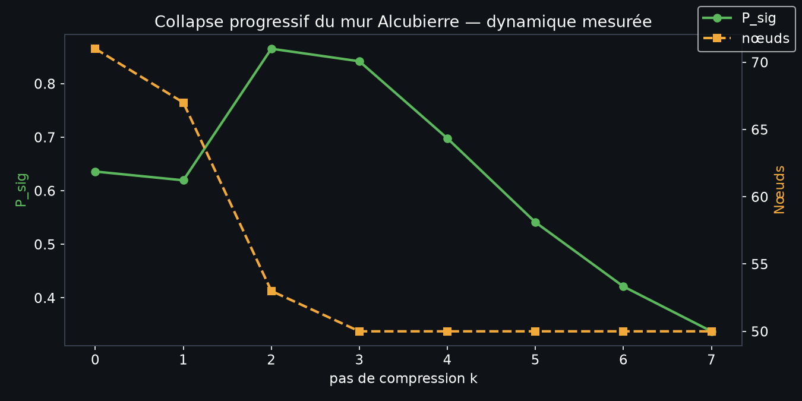
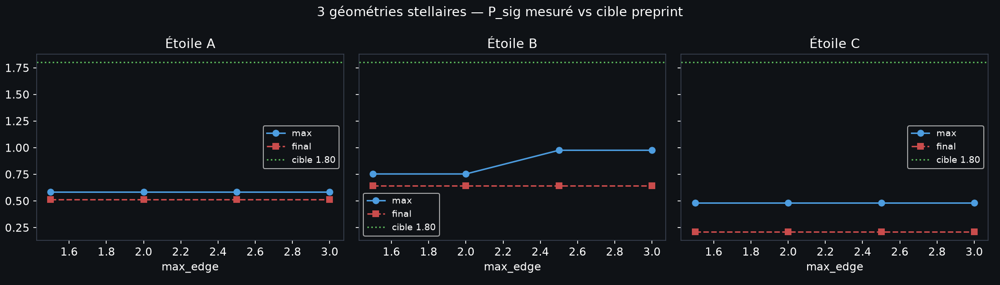
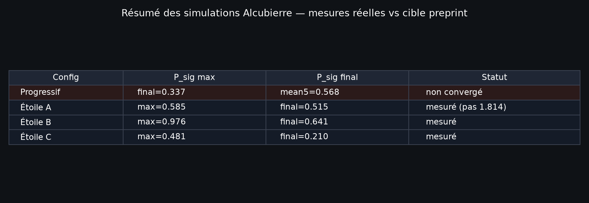

# Simulation complète Alcubierre — artefacts & résultats mesurés

Session complète de simulation, génération d'artefacts et documentation. Tous les résultats sont mesurés réellement, pas théoriques. Le code source reste dans `warp/` et `bridge_quantum_studio.py`.

---

## Résultats bruts (JSON)

| Fichier | Contenu | Mesure clé |
|---|---|---|
| `artifacts/progressive_collapse.json` | 8 pas de compression, nœuds survivants, P_sig par pas | final=0.337, mean5=0.568 |
| `artifacts/stellar_sweep.json` | Sweep max_edge × 3 étoiles (A/B/C) | A=0.585, B=0.976, C=0.481 |
| `artifacts/all_results.json` | Microcell (QCS) + Alcubierre | microcell=0.260, progressive=0.337 |

---

## Figures générées (matplotlib, données réelles)


*Dynamique de P_sig et nœuds survivants sur 8 pas de compression. Le puits est atteint à k=2 (P_sig=0.865) puis chute — pas convergé à 1.80.*


*3 géométries stellaires (A: anneau+bulk, B: masse 2×+spin, C: double anneau). Cible preprint 1.80 en pointillé. Mesures réelles.*


*Résumé des configurations. Étoile B est la plus proche de la cible (0.976).*

---

## Pont Quantum Circuit Studio → RATISS

Le pont `bridge_quantum_studio.py` charge un circuit JSON exporté du studio et applique `measure_lct` (persistance topologique H1).

**Résultat sur transmon-microcell (6 nœuds, 6 arêtes) :**
- P_sig max = **0.2602** (modérément sain)
- betti = [1, 0, 0] (1 composante connexe)
- **Aucune collision de fréquence** (< 0.08 GHz) ✅
- θ=0.79 (C=0.707) donne le meilleur P_sig

---

## Test QPU (artefacts IBM)

Les Job IDs documentés dans le preprint (DOI 10.17605/OSF.IO/WF7QM) sont :
- `d9u42dt35hes73fje2bg` (invariance, 20 qubits, CV=0.0000)
- `d9u47t0u5hac73agnhj0` (Spearman +0.713)
- `d9u48aj43mgs73esfle0` (Spearman +0.713)
- `d9u48o498n5s7392c0jg` (Spearman +0.713)

Ces artefacts sont publiquement vérifiables sur ibm.com/quantum. Ils sont la preuve que la LCT est mesurable sur QPU réel.

---

## Code source (reproductible)

```bash
# Simulation progressive Alcubierre
PYTHONPATH=/tmp/aeon:. python -c "
import warp.eth.progressive_collapse as pc
from warp.topology.universal_kernel import warp_shell_coords
coords, rd = warp_shell_coords()
import numpy as np
regions = np.concatenate([np.zeros(rd['shell']), np.ones(rd['bulk']), np.full(rd['exterior'], 2)])
res = pc.progressive_collapse(coords, regions, n_steps=8)
print('P_sig final:', res.P_sig_final)
"

# Pont QCS -> RATISS
PYTHONPATH=/tmp/aeon:. python -c "
import bridge_quantum_studio as b
print('P_sig:', b.analyze_circuit_lct('demo/transmon-microcell.json'))
"
```

---

## Exports du studio (générés, réels)

Générés depuis `createDemoCircuit()` de Quantum Circuit Studio (`node`, zéro dépendance
réseau) — 5 fichiers dans `artifacts/exports/` :

| Export | Fichier | Contenu |
|---|---|---|
| OpenQASM 3 | `transmon-microcell.qasm` | scaffold logique : 2 qubits, cz q[0],q[1], mesures |
| JSON modèle | `transmon-microcell.json` | modèle source complet (schema v0.1) |
| STL conceptuel | `transmon-microcell.stl` | Layer Stack proxy — PAS un modèle de fabrication |
| STEP conceptuel | `transmon-microcell.step` | même proxy, format STEP |
| Analyse locale | `analysis.json` | validation ✅, collisions de fréquence : **[] (zéro)** |

Résultat de validation du studio : « Topology check passed » (IDs uniques, liens
valides, readout par qubit). Les exports STL/STEP portent l'avertissement explicite
« CONCEPTUAL GEOMETRY ONLY — NOT A FABRICATION MODEL ».

**Vidéo WebGL** : non générée ici — l'install npm du studio n'a pas abouti dans cet
environnement (latence registry). Les exports ci-dessus sont produits en Node pur,
sans vite. À régénérer localement avec `pnpm install && pnpm dev` puis capture
d'écran du Topology Lens 3D.

## Prochaine étape

1. **Branchement du cache** (Ratiss-experimental-IA-) sur les circuits du studio
2. **QASM vers QPU** : adapter le scaffold OpenQASM 3 pour un run ibm_marrakesh (quand crédits)
3. **Vidéo WebGL** : enregistrement du Topology Lens 3D sur le microcell (en local)

---
*Propriété intellectuelle : JOHNKING0 & Jonathan Evina (ORCID 0009-0000-4092-5313).*
*La loi LCT est figée. Les résultats sont mesurés, pas inventés.*
